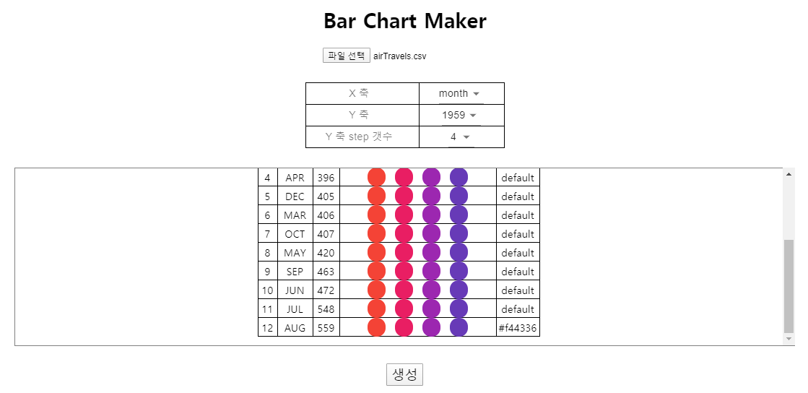

	
     
     

	

<h1>BarPoints 라이브러리</h1>

BarPoints는 d3의 막대그래프 그리는 기능을 모사하여 만들어본 라이브러리입니다. 단 CVS 데이터만 사용가능합니다. 
CVS 데이터에서 변환된 object 리스트와 x축과 y축이 설정을 가지고, 
new BarPoints(cvs에서 변환된 object list, x축 필드 이름, y축 필드 이름)를 통해 객체를 생성하면,  
BarPoints의 prototype으로 지정된 getPoints() 함수를 통해, 막대그래프의 각 막대를 그릴 <rect>의 속성값을 반환해줍니다. 
 
*Built-in 함수 설명 
- getPoints(): 각 막대에 해당될 <rect> 속성값 반환 
- setXYKeys(): BarPoint 객체의 x축, y축 설정 변경 
- setYStepsNum(): BarPoint 객체의 y축 step 갯수 변경 

 
 
<h1><b>Bar Chart Maker</b> 사용법</h1>

BarPoints 라이브러리를 사용하여, CVS 파일 데이터를 막대그래프로 시각화해줍니다.
 
 
1. cvs 파일 첨부 
2. x 축 과 y 축 설정 
3. (옵션) 각 바에 적용될 색상 설정  
3. 생성 버튼 클릭

  
 
